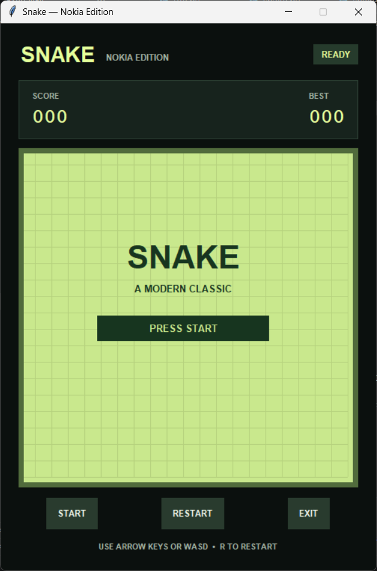
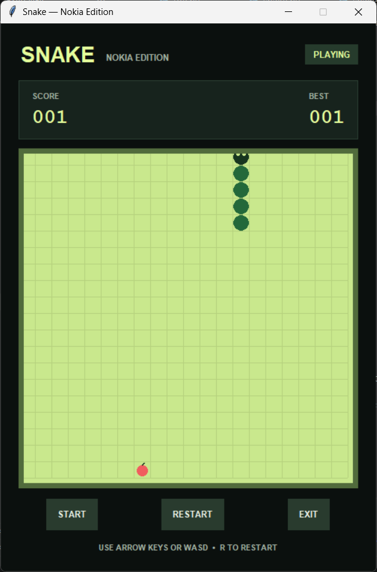

# 🐍 Snake – Nokia Edition

A modern recreation of the classic **Nokia Snake Game** built using **Python** and **Tkinter**. Inspired by the legendary Nokia mobile phones, this project combines a nostalgic LCD-style display with a clean and modern user interface.

---

## ✨ Features

- 🎮 Classic Snake Gameplay
- 📱 Nokia LCD Inspired Theme
- 🟢 Modern Retro User Interface
- 📊 Live Score Counter
- 🏆 High Score Tracking
- 🍎 Random Food Generation
- ⌨️ Supports Arrow Keys & WASD
- 🔄 Restart Game Anytime
- ❌ Game Over Detection
- 🚪 Exit Button
- ⚡ Smooth Animation

---

## 🛠️ Built With

- **Python 3**
- **Tkinter** (GUI Library)
- **Random Module**

---

## 📂 Project Structure

```text
snake-game_python/
│
├── .gitattributes
├── .gitignore
├── LICENSE
├── README.md
├── game.png
├── highscore.json
└── snake_game.py
```

---

## 🎮 Controls

| Key | Action |
|------|--------|
| ⬆️ | Move Up |
| ⬇️ | Move Down |
| ⬅️ | Move Left |
| ➡️ | Move Right |
| W | Move Up |
| A | Move Left |
| S | Move Down |
| D | Move Right |
| R | Restart Game |
| ESC | Exit Game |

---

# 🖥️ Screenshots

## 🏠 Home Screen

<p align="center">
  
</p>

---

## 🎮 Gameplay

<p align="center">
  
</p>

---

## 🎯 How to Play

1. Click **START** to begin the game.
2. Use **Arrow Keys** or **WASD** to move the snake.
3. Eat the food to increase your score.
4. Every food eaten makes the snake longer.
5. Avoid hitting the walls.
6. Avoid colliding with your own body.
7. Press **R** to restart the game.
8. Press **ESC** or click **Exit** to close the game.

---

## 📌 Game Rules

- 🍎 Each fruit increases your score by **1**.
- 🐍 The snake grows after eating food.
- 🚫 Collision with the wall ends the game.
- 🚫 Collision with the snake's body ends the game.
- 🏆 High Score is updated automatically during gameplay.

---

## 💡 Future Improvements

- 🔊 Sound Effects
- ⏸ Pause / Resume Feature
- 🎚 Difficulty Levels
- 💾 Save High Score Permanently
- 🌙 Dark & Light Themes
- 🎵 Background Music
- 🎁 Power-ups
- 🧱 Obstacles
- 🌐 Multiplayer Mode

---

## 👨‍💻 Author

**Vaibhav Saini**

🎓 B.Tech Computer Science Engineering Student


---

## 🤝 Contributing

Contributions are welcome!

If you'd like to improve this project:

1. Fork the repository.
2. Create a new branch.
3. Commit your changes.
4. Push your branch.
5. Open a Pull Request.

---

## ⭐ Show Your Support

If you enjoyed this project, consider giving it a ⭐ on GitHub.

It helps others discover the project and motivates future improvements.

---

## 📄 License

This project is licensed under the **MIT License**.

Feel free to use, modify, and distribute this project for educational purposes.

---

<p align="center">
Made with ❤️ using Python & Tkinter
</p>
